# Occlusion with obstacles
Collective transport algorithm based on Occlusion and chain forming for swarm robotics
> Project under development
## Usage
### Compiling
>[Argos](https://github.com/ilpincy/argos3) needs to be installed first

After cloning this repo, run the following commands in the folder Occlusion_with_obstacles
```
mkdir build
cd build
cmake ..
make
```
### Running 
In the folder Occlusion_with_obstacles, <br>
For my implementation of Occlusion Paper [[1]](#references):
```
argos3 -c experiments/occlusion.argos
```
For chain forming:
```
argos3 -c experiments/chain_forming.argos
```

## Concept
TODO
### State Machine Representation


### References
1. Occlusion based transport (without obstacles, unbounded environment) from:
[Chen, Jianing, et al. "Occlusion-based cooperative transport with a swarm of miniature mobile robots." _IEEE Transactions on Robotics_ 31.2 (2015): 307-321.](http://ieeexplore.ieee.org/abstract/document/7055285/)
2. Chain forming inspired from: 
[Pinciroli, Carlo, et al. "Adaptation and awareness in robot ensembles: Scenarios and algorithms." _Software Engineering for Collective Autonomic Systems_. Springer, Cham, 2015. 471-494.](https://link.springer.com/chapter/10.1007/978-3-319-16310-9_15 )
3. [Argos-examples](https://github.com/ilpincy/argos3-examples)
