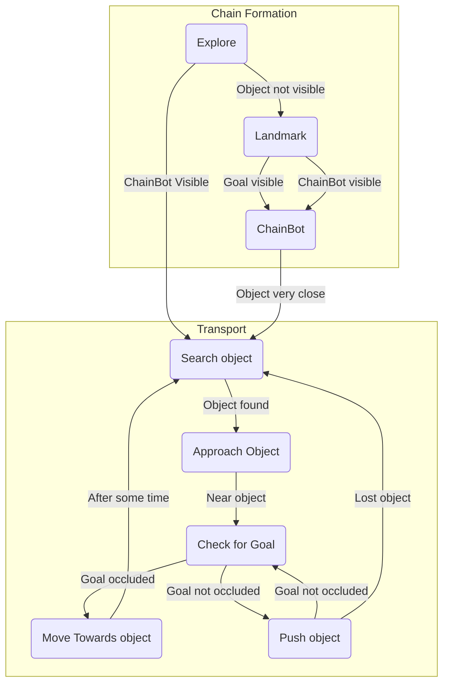

```mermaid
graph TD
A1-->|ChainBot Visible|A
C1-->|Object very close|A
subgraph Transport
A(Search object) -->|Object found| B(Approach Object)
B -- Near object --> D(Check for Goal)
C --> |After some time| A
D -->|Goal occluded| C(Move Towards object)
D-->|Goal not occluded| F(Push object)
F --> |Goal not occluded| D
F --> |Lost object| A
end
subgraph Chain Formation
A1(Explore) -->|Object not visible| B1(Landmark)
B1-->|Goal visible| C1(ChainBot)
B1-->|ChainBot visible| C1
end
```